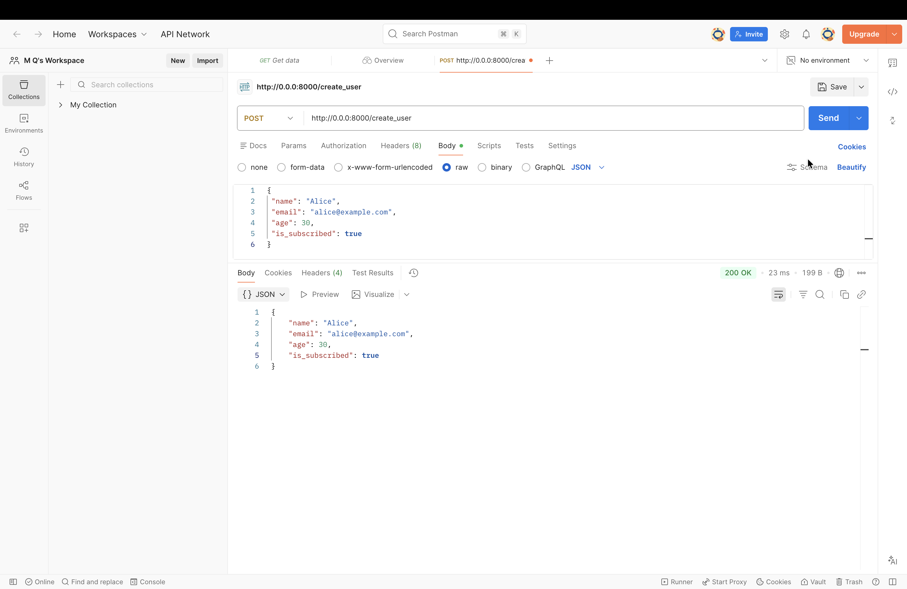
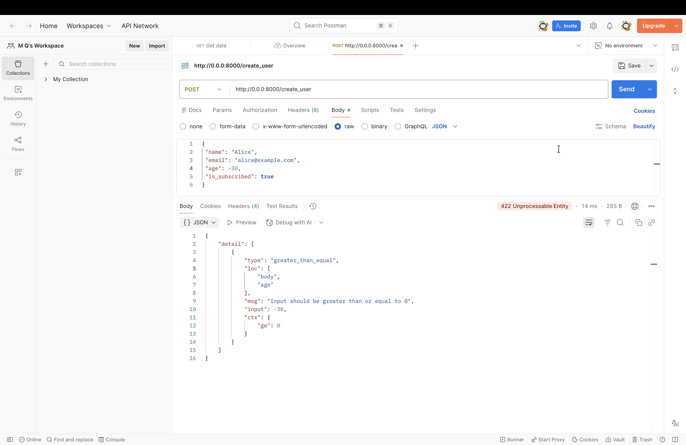
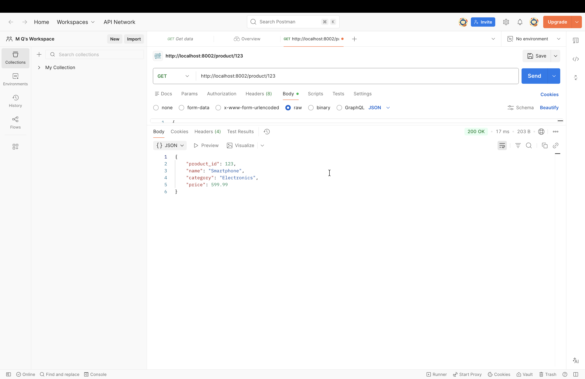
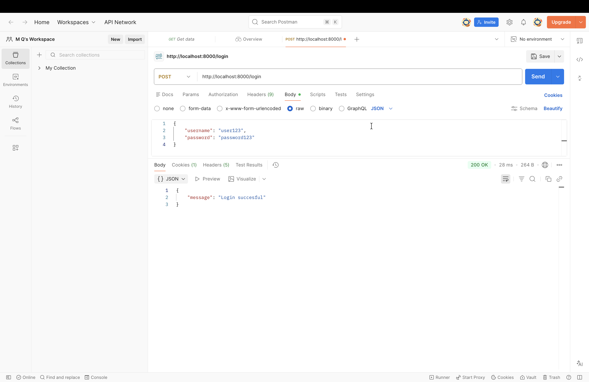
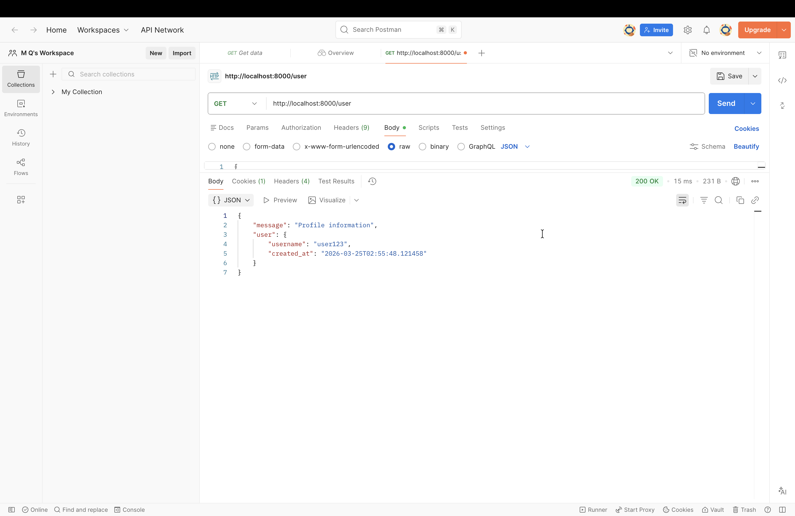
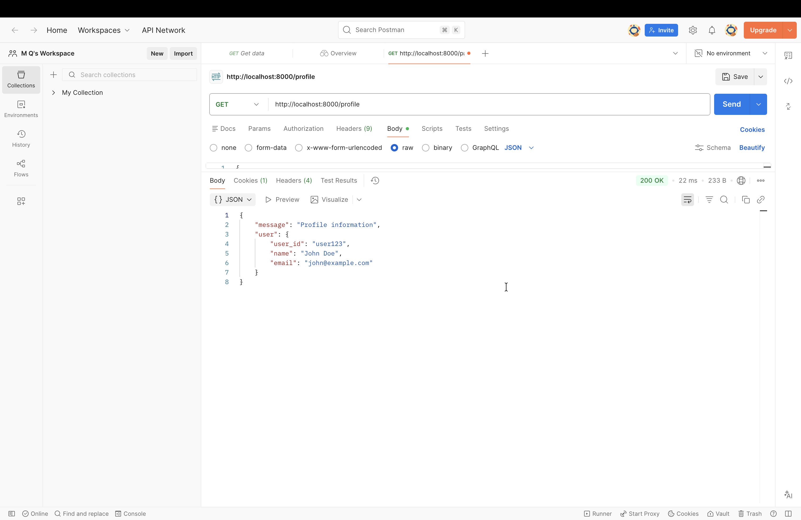
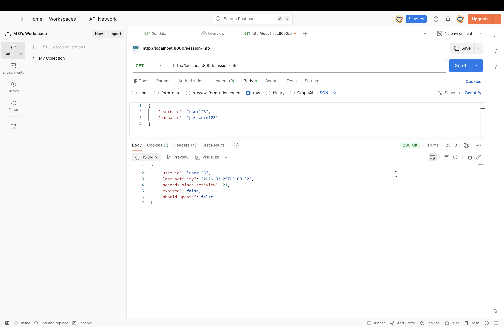
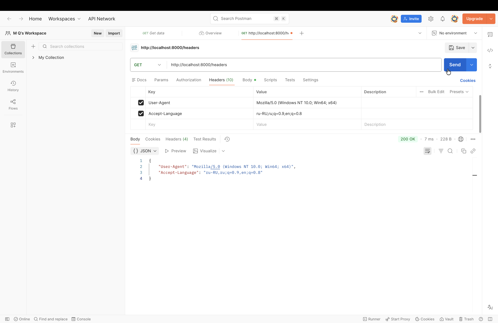
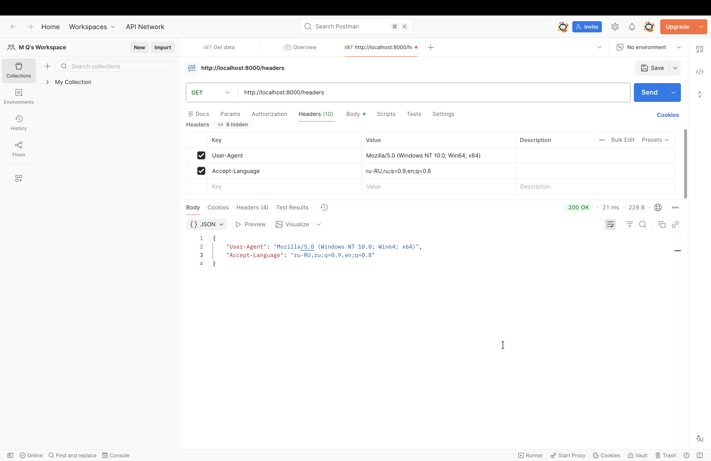
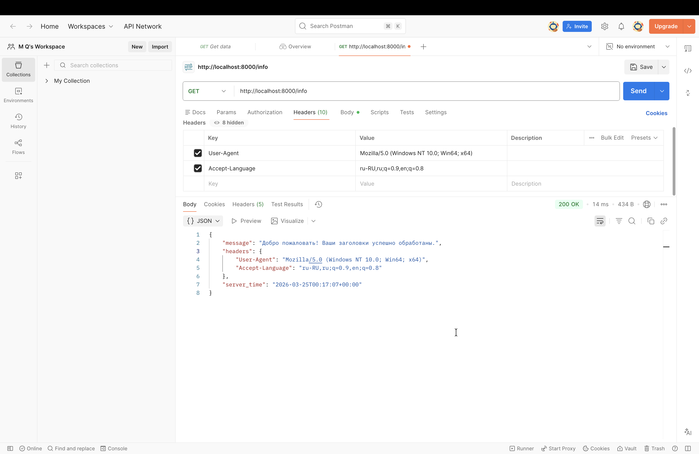

# Контрольная работа 2

**Технологии разработки серверных приложений**  
**Студент:** Доськова Мария Павловна  
**Группа:** ЭФБО-03-24  
**Семестр:** 4 семестр, 2025/2026 уч. год

## Инструкция по запуску
1. Клонировать репозиторий:

git clone https://github.com/mitjink/sadt_kr1  

2. Создать и активировать виртуальное окружение:

### Windows
python -m venv venv  
venv\Scripts\activate

### Mac/Linux
python3 -m venv venv  
source venv/bin/activate

3. Установить зависимости:

pip install fastapi uvicorn pydantic itsdangerous python-multipart

Запустить нужное задание:  

Задание 3.1:  
uvicorn task_3_1:app --reload --port 8001  

Задание 3.2:  
uvicorn task_3_2:app --reload --port 8002  

Задание 5.1:  
uvicorn task_5_1:app --reload --port 8003  

Задание 5.2:  
uvicorn task_5_2:app --reload --port 8004  

Задание 5.3:  
uvicorn task_5_3:app --reload --port 8005  

Задание 5.4:  
uvicorn task_5_4:app --reload --port 8006  

Задание 5.5:  
uvicorn task_5_5:app --reload --port 8006

## Задание 3.1

## Задание 3.2

## Задание 5.1

## Задание 5.2

## Задание 5.3

## Задание 5.4

## Задание 5.5

